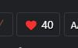

# FFXIV 玩家列表

> [🇺🇸 English](README.md) · 🇨🇳 简体中文

[🔗FFXIV 玩家列表](http://ffxiv-plugins.migawari.top/FFXIV-Player-List/README-CN.html) 这是一个用于 FF14 ACT 插件 Ngld 悬浮窗插件的插件。显示周围玩家的名字，玩家根据见面次数排序，记录见面的人数，根据职业进行着色，未满级的玩家会显示其等级。

## 截图
* 显示周围玩家列表；可切换字体小、中、大。
    * 

* 平时，只显示一个图标。点击以展开和隐藏界面。数字表示周围玩家的数量。
    * 

* 点击小锁头，并在插件中设置「鼠标穿透」，进入无干扰模式；再次点击小锁头解锁。
    * 

* 见面计数。点击并确认后将重置见面计数器。数字表示一共见过多少玩家。
    * 

## 使用方法
### 初次使用
1. 打开 ACT → 插件 → ngld 悬浮窗插件 → 新建。
2. 名称：随意，预设：自订，种类：数据统计。
3. 悬浮窗路径：`https://ffxiv-plugins.migawari.tk/FFXIV-Player-List/ffxivplayerlist.html`

## 第三方库
* [🔗jQuery](https://www.bootcdn.cn/jquery/) · [🔗BootStrap4](https://www.bootcdn.cn/twitter-bootstrap/) · [🔗Ngld Common JS](https://ngld.github.io/OverlayPlugin/assets/shared/common.min.js)
