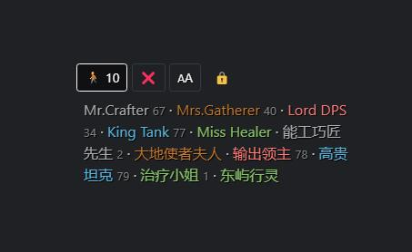
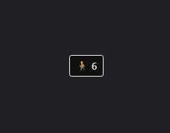
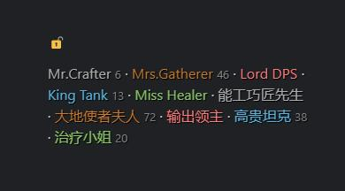
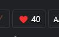

# FFXIV Player List

> 🇺🇸 English · [🇨🇳 简体中文](README-CN.md)

[🔗FFXIV Player List](https://ffxiv-plugins.github.io/FFXIV-Player-List/) This is a plugin for FFXIV ACT Ngld Overlay. Show players around you. Sort the players based on your meet ups. Count the number of unique players you met. Colored name based on the job. For players under level 80, show their levels.

## Screenshots
* Show players around you in the list. Can select font size from small, medium or large.
    * 

* Normally, only an icon shows up. Click to hide/show dashboard. The number of players around you is displayed.
    * 

* Click the lock and set "Click Though" in the overlay plugin to enter focus mode. Click the lock again to unlock.
    * 

* Meet Up counts. Click this button will reset the meet up counter after your comfirmation. The number of players you ever met is displayed.
    * 

## Usage
### Get Started
1. Open ACT → Plugin → ngld Overlay → new.
2. Name: Keyword, Preset: Custom, Catagory: Data.
3. Overlay Path: `https://ffxiv-plugins.github.io/FFXIV-Player-List/ffxivplayerlist.html`

## 3rd Party Libs
* [🔗jQuery](https://www.bootcdn.cn/jquery/) · [🔗BootStrap4](https://www.bootcdn.cn/twitter-bootstrap/) · [🔗Ngld Common JS](https://ngld.github.io/OverlayPlugin/assets/shared/common.min.js)
